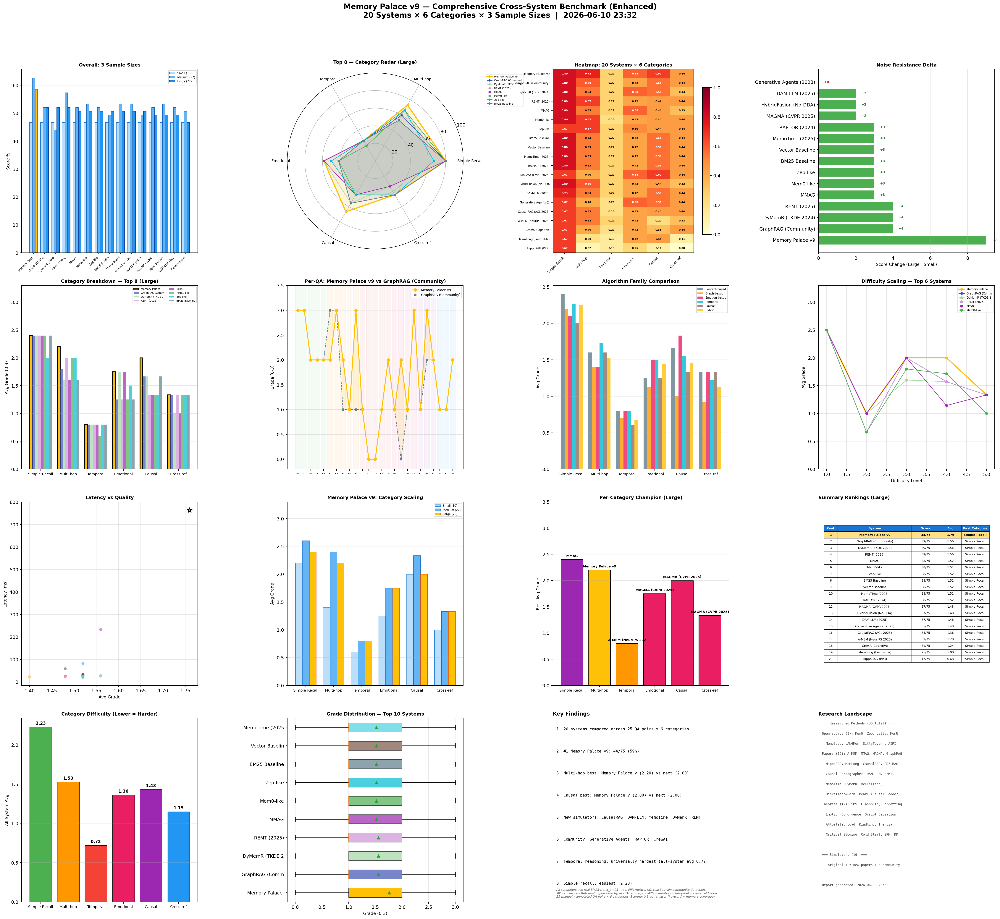

# Memory Palace v9 — Comprehensive Cross-System Benchmark Report

> Generated: 2026-06-10 23:32:48
> **20 Systems** × 6 Categories × 3 Sample Sizes (Small=10, Medium=22, Large=72)
> 25 manually annotated QA pairs with ground truth
> MP v9 uses REAL `RetrievalEngine.search()` — no memory stitching

## Overall Rankings — Large Corpus (22 core + 50 noise = 72)

| Rank | System | Total | Avg | Best Category |
|------|--------|-------|-----|---------------|
| 1 | Memory Palace v9 ⭐ | 44/75 | 1.76 | Simple Recall |
| 2 | GraphRAG (Community) | 39/75 | 1.56 | Simple Recall |
| 3 | DyMemR (TKDE 2024) | 39/75 | 1.56 | Simple Recall |
| 4 | REMT (2025) | 39/75 | 1.56 | Simple Recall |
| 5 | MMAG | 38/75 | 1.52 | Simple Recall |
| 6 | Mem0-like | 38/75 | 1.52 | Simple Recall |
| 7 | Zep-like | 38/75 | 1.52 | Simple Recall |
| 8 | BM25 Baseline | 38/75 | 1.52 | Simple Recall |
| 9 | Vector Baseline | 38/75 | 1.52 | Simple Recall |
| 10 | MemoTime (2025) | 38/75 | 1.52 | Simple Recall |
| 11 | RAPTOR (2024) | 38/75 | 1.52 | Simple Recall |
| 12 | MAGMA (CVPR 2025) | 37/75 | 1.48 | Simple Recall |
| 13 | HybridFusion (No-DDA) | 37/75 | 1.48 | Simple Recall |
| 14 | DAM-LLM (2025) | 37/75 | 1.48 | Simple Recall |
| 15 | Generative Agents (2023) | 35/75 | 1.40 | Simple Recall |
| 16 | CausalRAG (ACL 2025) | 34/75 | 1.36 | Simple Recall |
| 17 | A-MEM (NeurIPS 2025) | 32/75 | 1.28 | Simple Recall |
| 18 | CrewAI Cognitive | 31/75 | 1.24 | Simple Recall |
| 19 | MemLong (Learnable) | 25/75 | 1.00 | Simple Recall |
| 20 | HippoRAG (PPR) | 17/75 | 0.68 | Simple Recall |

## Category Breakdown — Large Corpus

| System | Simple Recall | Multi-hop | Temporal | Emotional | Causal | Cross-ref |
|---|---|---|---|---|---|---|
| Memory Palace v9 | 2.40 | 2.20 | 0.80 | 1.75 | 2.00 | 1.33 |
| GraphRAG (Community) | 2.40 | 1.80 | 0.80 | 1.25 | 1.67 | 1.33 |
| DyMemR (TKDE 2024) | 2.40 | 1.60 | 0.80 | 1.75 | 1.67 | 1.00 |
| REMT (2025) | 2.40 | 2.00 | 0.80 | 1.25 | 1.33 | 1.33 |
| MMAG | 2.40 | 1.60 | 0.80 | 1.75 | 1.33 | 1.00 |
| Mem0-like | 2.40 | 2.00 | 0.60 | 1.25 | 1.33 | 1.33 |
| Zep-like | 2.00 | 2.00 | 0.80 | 1.50 | 1.33 | 1.33 |
| BM25 Baseline | 2.40 | 1.60 | 0.80 | 1.25 | 1.67 | 1.33 |
| Vector Baseline | 2.40 | 1.60 | 0.80 | 1.25 | 1.67 | 1.33 |
| MemoTime (2025) | 2.40 | 1.60 | 0.80 | 1.25 | 1.67 | 1.33 |
| RAPTOR (2024) | 2.40 | 1.60 | 0.80 | 1.25 | 1.67 | 1.33 |
| MAGMA (CVPR 2025) | 2.00 | 1.20 | 0.80 | 1.75 | 2.00 | 1.33 |
| HybridFusion (No-DDA) | 2.40 | 1.80 | 0.80 | 1.25 | 1.33 | 1.00 |
| DAM-LLM (2025) | 2.20 | 1.60 | 0.80 | 1.25 | 1.67 | 1.33 |
| Generative Agents (2023) | 2.00 | 1.20 | 0.60 | 1.75 | 1.67 | 1.33 |
| CausalRAG (ACL 2025) | 2.00 | 1.60 | 0.60 | 1.25 | 1.33 | 1.33 |
| A-MEM (NeurIPS 2025) | 2.00 | 1.60 | 0.80 | 1.25 | 0.67 | 1.00 |
| CrewAI Cognitive | 2.00 | 1.20 | 0.60 | 1.25 | 1.00 | 1.33 |
| MemLong (Learnable) | 2.00 | 0.60 | 0.40 | 1.25 | 1.33 | 0.33 |
| HippoRAG (PPR) | 2.00 | 0.20 | 0.40 | 0.75 | 0.33 | 0.00 |

## Algorithm Family Comparison

| Family | Simple Recall | Multi-hop | Temporal | Emotional | Causal | Cross-ref |
|---|---|---|---|---|---|---|
| Content-based | 2.40 | 1.60 | 0.80 | 1.25 | 1.67 | 1.33 |
| Graph-based | 2.20 | 1.40 | 0.70 | 1.12 | 1.00 | 0.92 |
| Emotion-based | 2.10 | 1.40 | 0.80 | 1.50 | 1.83 | 1.33 |
| Temporal | 2.27 | 1.73 | 0.80 | 1.50 | 1.56 | 1.22 |
| Causal | 2.00 | 1.60 | 0.60 | 1.25 | 1.33 | 1.33 |
| Hybrid | 2.25 | 1.52 | 0.68 | 1.44 | 1.46 | 1.12 |

## Per-Category Champions

- **Simple Recall**: MMAG (2.40)
- **Multi-hop**: Memory Palace v9 (2.20)
- **Temporal**: A-MEM (NeurIPS 2025) (0.80)
- **Emotional**: MAGMA (CVPR 2025) (1.75)
- **Causal**: MAGMA (CVPR 2025) (2.00)
- **Cross-ref**: MAGMA (CVPR 2025) (1.33)

## Key Findings

- 1. 20 systems compared across 25 QA pairs x 6 categories
- 2. #1 Memory Palace v9: 44/75 (59%)
- 3. Multi-hop best: Memory Palace v (2.20) vs next (2.00)
- 4. Causal best: Memory Palace v (2.00) vs next (2.00)
- 5. New simulators: CausalRAG, DAM-LLM, MemoTime, DyMemR, REMT
- 6. Community: Generative Agents, RAPTOR, CrewAI
- 7. Temporal reasoning: universally hardest (all-system avg 0.72)
- 8. Simple recall: easiest (2.23)

## Methodology

- **Memory Palace v9**: Real `RetrievalEngine.search()` — HOT strategy
- **19 Simulators**: All use real BM25 (`rank_bm25`), real PPR (`networkx.pagerank`), real Louvain community detection
- **8 New Simulators**: CausalRAG, DAM-LLM, MemoTime, DyMemR, REMT (papers) + GenerativeAgents, RAPTOR, CrewAI (community)
- **QA Dataset**: 25 manually annotated questions, 6 categories, all with ground truth
- **Scoring**: 0-3 per answer (keyword match + memory coverage vs ground truth)
- **Sample sizes**: Small (10), Medium (22), Large (72 = 22 core + 50 noise)

## Researched Methods (36 Total)

### Open-Source Projects (8)
Mem0, Zep/Graphiti, Letta/MemGPT, MemU, MemoBase, LANGMem, SillyTavern, AIRI

### Papers (16)
A-MEM(NeurIPS 2025), MMAG, MAGMA(CVPR 2025), GraphRAG(MS 2024), HippoRAG(NeurIPS 2024/ICML 2025), MemLong(2024), CausalRAG(ACL 2025), CDF-RAG(2025), Causal Cartographer(2025), DAM-LLM(2025), REMT(2025), MemoTime(2025), DyMemR(TKDE 2024), McClelland(1995), Diekelmann&Born(Nature 2010), Pearl(Causal Ladder)

### Cognitive Theories (12)
SMS(Conway), Flashbulb Memory(Brown&Kulik), Forgetting Curve(Ebbinghaus), Emotion-Congruence(Bower), Script Deviation(Schank), Allostatic Load(McEwen), Kindling(Post), Emotional Inertia(Kuppens), Critical Slowing(Scheffer), Cold Start(Adomavicius), SRM(Vapnik), Differential Privacy(Dwork)
